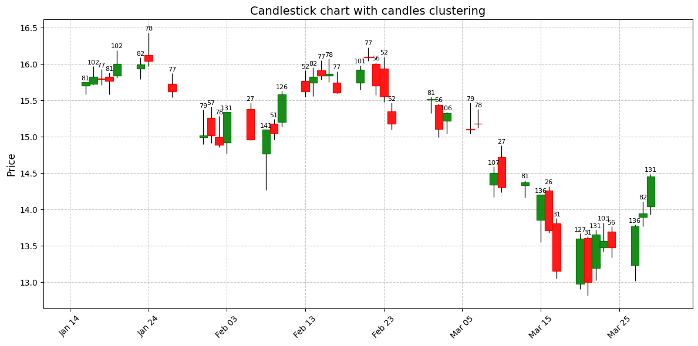

# Candlestick Clustering



## Description
This project aims to apply **clustering** techniques to analyze patterns in financial **candlesticks**. By using **machine learning**, we seek to identify groups of candles with similar characteristics, assisting in trend analysis and decision-making in the financial market.

## Technologies and Tools Used
- **yfinance** → Financial data collection
- **mplfinance** → Candlestick chart visualization
- **Python** → Main programming language
- **Pandas** → Data manipulation and analysis
- **NumPy** → Mathematical operations and array handling
- **Matplotlib / Seaborn** → Data visualization
- **Scikit-learn** → Implementation of clustering algorithms
- **Jupyter Notebook** → Development and testing

## Project Structure
```
candlestick_clustering
│── notebooks           # Jupyter Notebooks with exploratory analysis and modeling
│── scripts                 # Project source code
│   ├── data_preparation.py   # Functions for data processing and cleaning
│   ├── clustering.py      # Implementation of clustering algorithms
│   ├── plotting.py   # Functions for results visualization
|   |── main.py             # Main script to run the project
│── README.md              # Project documentation
│── requirements.txt       # Project dependencies
```

## Prerequisites
Before running the project, make sure you have installed:
- **Python 3.8+**
- Dependencies listed in `requirements.txt`

Install dependencies with:
```bash
pip install -r requirements.txt
```

## How to Run the Project
1. Clone the repository:
```bash
git clone https://github.com/polyanasilva/candlestick_clustering.git
```
2. Navigate to the directory:
```bash
cd candlestick_clustering
```
3. Run a Jupyter Notebook or execute the main script:
```bash
jupyter notebook
```
Or:
```bash
python scripts/clustering.py
```

## Methodology
1. **Data Collection**: Import historical candlestick data.
2. **Preprocessing**: Cleaning, normalization, and feature extraction.
3. **Clustering**: Applying algorithms such as K-Means.
5. **Visualization**: Charts for cluster analysis.

## Results
Clustering results are presented in charts and tables, highlighting patterns in candlesticks.

## References
- Sutton, R. S., & Barto, A. G. (2018). Reinforcement Learning: An Introduction.
- Murphy, J. J. (1999). Technical Analysis of the Financial Markets.
- Scikit-learn Documentation: https://scikit-learn.org/

## Contribution
Feel free to contribute! **Fork** the repository, create a **branch**, and submit a **pull request**.

## License
This project is licensed under the MIT License - see the `LICENSE` file for details.

